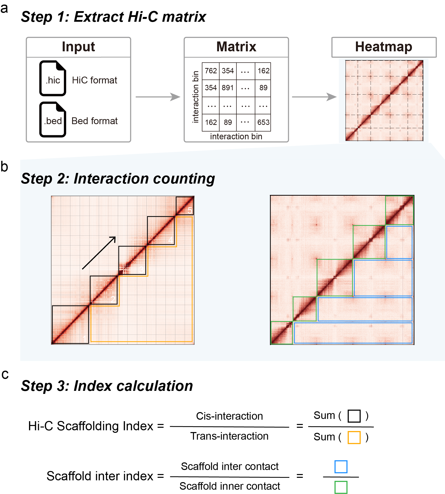

# Benchmarking Hi-C-based scaffolding tools
This repository primarily contains scripts and computational code used to calculate `Hi-C scaffolding index` and to perform data **simulation, scaffolding, evaluation**, and processing, as described in the manuscript.  

Author: Zijie Jiang

Email: [jiangzijie@sjtu.edu.cn](mailto:jiangzijie@sjtu.edu.cn)

​	 

​	 

## Content

- [Benchmarking Hi-C-based scaffolding tools](#benchmarking-hi-c-based-scaffolding-tools)
  - [Content](#content)
  - [Hi-C scaffolding index](#hi-c-scaffolding-index)
    - [1. Preprocessing](#1-preprocessing)
    - [2. Hi-C scaffolding index](#2-hi-c-scaffolding-index)
    - [3. plot index plot](#3-plot-index-plot)
  - [Simulation](#simulation)
  - [Scaffolding](#scaffolding)
  - [Evaluation](#evaluation)
  - [Citations](#citations)
  - [License](#license)


  

## Hi-C scaffolding index




`HSI` is defined as the ratio of cis- to trans-interactions across the whole-genome interaction matrix and is computed in three main steps. First, the whole-genome interaction matrix is extracted from the input file, which can be provided in either dense (.hic) or sparse (.bed) format. This matrix serves as the basis for subsequent calculations. Second, the matrix is partitioned into submatrices according to the user-specified resolution and scaffold size to facilitate localized counting. Finally, the `HSI` is calculated using predefined formulas 

 	 

​	 

### 1. Preprocessing

First, the whole-genome interaction matrix is extracted from the Hi-C results based on the specified resolution.

```sh
juicer_tool=/paht/juicer/scripts/common/juicer_tools.jar

hic_path=sample_scaffolder.hic

resolution=500000

output=sample_scaffolderr_500K.txt

java -Xmx100g -jar $juicer_tool dump observed KR $hic_path assembly assembly BP $resolution $output
```

Nots:

- `juicer_tools.jar` is from https://github.com/aidenlab/juicer

- The `.hic` file is generated from the scaffolding results; please refer to the respective scaffolders' tutorials for more information.

- The `resolution` used in this article were 100kb, 500kb, and 2.5Mb. Higher resolutions require more time to extract the matrix and calculate the Hi-C interaction ratio.  It is recommended to calculate the Hi-C interaction ratio at multiple resolutions (here use 500kb for example). 

  ​     

### 2. Hi-C scaffolding index

```sh
python3 ./HSI/hsi.py <matrix_file> <chrom_lengths_file> <bin_size> <outdir>
```

Nots:

- `matrix` from the preceding preprocessing step.
- `chrom_lengths_file` contains the lengths of each sequence in the scaffolds (format: name /t length).
- The `bin_size` used in this article were 100kb, 500kb, and 2.5Mb. It is recommended to calculate at multiple resolutions (here use 500kb for example).


### 3. plot index plot

Visualizing the index curve for each scaffold allows for the identification of potential intra-scaffold misassemblies.

```sh
python ./HSI/plot_index.py <index.txt> <outdir>
```

Nots:

- `index.txt` from calculate Hi-C scaffolding index step.


## Simulation

Details regarding the data simulation can be found in [simulation](https://github.com/Jwindler/Benchmarking-Hi-C-scaffolding-tools/blob/main/1.simulation/simulation.md). 

 	 

## Scaffolding

Details regarding the scaffolding can be found in [scaffolding](https://github.com/Jwindler/Benchmarking-Hi-C-scaffolding-tools/tree/main/2.scaffolding/scaffolding.md). 

​	  

## Evaluation

Details regarding the performance evaluation can be found in [evaluation](https://github.com/Jwindler/Benchmarking-Hi-C-scaffolding-tools/blob/main/3.evaluation/evaluation.md). 

​	 

## Citations

**If you used** `Hi-C scaffolding index` **in your research, please cite us:**

```
```

​	 

## License

This software is distributed under the `GNU General Public License v3.0`.
